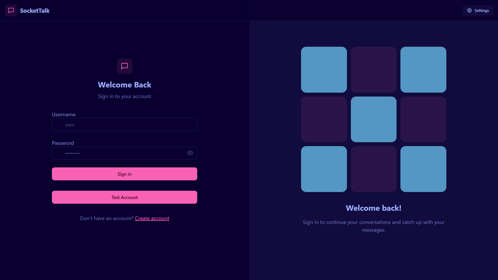

# 🚀 SocketTalk - Real-Time Chat Application



SocketTalk is a modern, full-stack real-time chat application built with React, Node.js, Socket.IO, and MongoDB. It features a beautiful, responsive UI with multiple themes, real-time messaging, image sharing, and comprehensive user management.


## 🌟 Live Demo

- **Frontend**: [https://sockettalk.vercel.app](https://sockettalk.vercel.app)
- **Backend**: Deployed on Azure App Service (API endpoints available through frontend)

## ✨ Features

### 🔐 Authentication & User Management
- **Secure Signup/Login** - JWT-based authentication with bcrypt password hashing
- **Cross-Domain Authentication** - Secure cookie handling for production deployment
- **Input Validation** - Comprehensive form validation using Zod schema
- **Profile Management** - Update profile pictures with Cloudinary integration
- **Test Account** - Quick demo access with predefined test credentials (`zoropy / zoro@123`)
- **Protected Routes** - Secure navigation with authentication middleware
- **Session Management** - Persistent login with HTTP-only cookies

### 💬 Real-Time Chat
- **Instant Messaging** - Real-time bidirectional communication using Socket.IO
- **Online Status** - Live user presence indicators
- **Message History** - Persistent chat history with MongoDB
- **Real-time Updates** - Messages appear instantly for both sender and receiver
- **Auto-scroll** - Smooth scrolling to latest messages
- **Connection Management** - Robust socket connection handling

### 🖼️ Media Sharing
- **Image Upload** - Share images directly in chat (up to 10MB)
- **Image Preview** - Preview images before sending
- **Profile Pictures** - Custom avatar upload with Cloudinary
- **Base64 Processing** - Optimized image handling

### 🎨 Theming & UI
- **32+ Themes** - Extensive theme collection powered by DaisyUI
- **Theme Preview** - Live theme switching with preview
- **Responsive Design** - Mobile-first, adaptive layout
- **Modern UI** - Clean, intuitive interface with Tailwind CSS
- **Dark/Light Modes** - Multiple color schemes

### 👥 Social Features
- **User Discovery** - Browse all registered users
- **Online Filter** - Show only online users
- **Contact List** - Organized sidebar with user status
- **User Profiles** - Detailed profile information

### 🛠️ Technical Features
- **Real-time Updates** - Socket.IO for instant communication
- **State Management** - Zustand for efficient state handling
- **Error Handling** - Comprehensive error management with toast notifications
- **Loading States** - Skeleton loaders for better UX
- **Form Validation** - Client and server-side validation
- **Secure Cookies** - HTTP-only JWT cookies 

### 🚀 Deployment Features
- **Frontend Deployment** - Vercel with SPA routing configuration
- **Backend Deployment** - Azure App Service with Node.js runtime
- **Environment Management** - Separate development and production configurations
- **Cross-Domain Setup** - Proper CORS and cookie settings for production
- **Static File Serving** - Optimized asset delivery

## 🛠️ Tech Stack

### Frontend
- **React 19** - Modern UI library with hooks
- **Zustand** - Lightweight state management
- **React Router DOM** - Client-side routing
- **Socket.IO Client** - Real-time communication
- **Axios** - HTTP client for API calls
- **Tailwind CSS** - Utility-first CSS framework
- **DaisyUI** - Beautiful component library
- **Lucide React** - Modern icon library
- **React Hot Toast** - Elegant notifications
- **Vite** - Fast build tool and dev server

### Backend
- **Node.js** - JavaScript runtime environment
- **Express.js** - Fast, minimalist web framework
- **Socket.IO** - Real-time bidirectional communication
- **MongoDB** - NoSQL database with Mongoose ODM
- **JWT** - JSON Web Tokens for authentication
- **bcryptjs** - Password hashing
- **Zod** - TypeScript-first schema validation
- **Cloudinary** - Cloud-based image management
- **Cookie Parser** - Parse HTTP cookies
- **CORS** - Cross-origin resource sharing

### Development & Deployment
- **ESLint** - Code linting and formatting
- **Nodemon** - Development server auto-restart
- **dotenv** - Environment variable management
- **Vercel** - Frontend hosting with SPA routing
- **Azure App Service** - Backend hosting with Node.js runtime
- **Function-based CORS** - Robust cross-origin handling
- **Production Optimized** - Environment-specific configurations

## 🚀 Quick Start

### Prerequisites
- Node.js 18+ and npm
- MongoDB database
- Cloudinary account (for image uploads)

### Installation

1. **Clone the repository**
   ```bash
   git clone https://github.com/yourusername/sockettalk.git
   cd sockettalk
   ```

2. **Install dependencies**
   ```bash
   # Install root dependencies
   npm install
   
   # Install backend dependencies
   cd backend && npm install
   
   # Install frontend dependencies
   cd ../frontend && npm install
   ```

3. **Environment Setup**
   
   Create `.env` file in the backend directory:
   ```env
   # Database
   MONGODB_URL=your_mongodb_connection_string
   
   # JWT
   JWT_SECRET=your_super_secret_jwt_key
   
   # Cloudinary (for image uploads)
   CLOUDINARY_CLOUD_NAME=your_cloudinary_cloud_name
   CLOUDINARY_API_KEY=your_cloudinary_api_key
   CLOUDINARY_API_SECRET=your_cloudinary_api_secret
   
   # Server
   NODE_ENV=development
   PORT=5001
   ```

   Create `.env.local` file in the frontend directory:
   ```env
   # For development
   VITE_API_URL=http://localhost:5001
   
   # For production, this will be automatically configured
   # to point to your deployed backend
   ```

4. **Start Development Servers**
   
   Backend:
   ```bash
   cd backend
   npm run dev
   ```
   
   Frontend (in new terminal):
   ```bash
   cd frontend
   npm run dev
   ```

5. **Access the Application**
   - Frontend: http://localhost:5173
   - Backend API: http://localhost:5001

### Production Deployment

#### Vercel (Frontend)
1. **Create `vercel.json` in frontend directory:**
   ```json
   {
     "rewrites": [
       { "source": "/(.*)", "destination": "/index.html" }
     ]
   }
   ```

2. **Deploy to Vercel:**
   ```bash
   cd frontend
   vercel --prod
   ```

#### Azure App Service (Backend)
1. **Prepare for deployment:**
   ```bash
   cd backend
   # Remove problematic dependencies if any
   npm install --production
   ```

2. **Configure CORS for production:**
   ```javascript
   // In src/index.js and src/lib/socket.js
   app.use(cors({
     origin: function (origin, callback) {
       const allowedOrigins = [
         "http://localhost:5173",
         "https://your-frontend-app.vercel.app"
       ];
       // Function-based validation for robust CORS
     },
     credentials: true
   }))
   ```

3. **Deploy to Azure:**
   - Connect your GitHub repository to Azure App Service
   - Configure Node.js runtime in Azure portal
   - Set environment variables in Azure Application Settings
   - Update frontend environment to point to your Azure backend URL

#### Environment Configuration
- **Development**: Frontend connects to `http://localhost:5001`
- **Production**: Frontend connects to your deployed Azure backend
- **Cookies**: `sameSite: "none", secure: true` for cross-domain authentication
- **CORS**: Function-based origin validation for multiple domains
- **Security**: Environment variables and API URLs should be kept private

## 📁 Project Structure

```
sockettalk/
├── backend/
│   ├── src/
│   │   ├── controllers/          # Route controllers
│   │   │   ├── auth.controller.js
│   │   │   ├── message.controller.js
│   │   │   └── user.controller.js
│   │   ├── lib/                  # Utilities and configs
│   │   │   ├── cloudinary.js
│   │   │   ├── db.js
│   │   │   ├── socket.js
│   │   │   └── utils/
│   │   ├── middleware/           # Express middleware
│   │   │   ├── protectedRoute.middleware.js
│   │   │   └── validate.middleware.js
│   │   ├── models/               # MongoDB models
│   │   │   ├── User.model.js
│   │   │   ├── message.model.js
│   │   │   └── notification.model.js
│   │   ├── routes/               # API routes
│   │   │   ├── auth.route.js
│   │   │   └── message.route.js
│   │   ├── zodSchema/            # Validation schemas
│   │   │   └── auth.zodSchema.js
│   │   └── index.js              # Server entry point
│   ├── .env.example
│   └── package.json
├── frontend/
│   ├── src/
│   │   ├── components/           # React components
│   │   │   ├── skeletons/        # Loading components
│   │   │   ├── ChatContainer.jsx
│   │   │   ├── ChatHeader.jsx
│   │   │   ├── MessageInput.jsx
│   │   │   ├── Navbar.jsx
│   │   │   ├── NoChatContent.jsx
│   │   │   └── SideBar.jsx
│   │   ├── constants/            # App constants
│   │   │   └── index.js
│   │   ├── lib/                  # Utilities
│   │   │   ├── axios.js
│   │   │   └── utils.js
│   │   ├── pages/                # Route pages
│   │   │   ├── HomePage.jsx
│   │   │   ├── ProfilePage.jsx
│   │   │   ├── SettingPage.jsx
│   │   │   ├── SignInPage.jsx
│   │   │   ├── SignUpPage.jsx
│   │   │   └── NotFoundPage.jsx
│   │   ├── store/                # State management
│   │   │   ├── useAuthStore.js
│   │   │   ├── useChatStore.js
│   │   │   └── useThemeStore.js
│   │   ├── App.jsx
│   │   ├── main.jsx
│   │   └── index.css
│   ├── vercel.json              # Vercel SPA routing config
│   ├── package.json
│   └── vite.config.js
├── package.json
└── README.md
```

## 🔧 API Endpoints

### Authentication
- `POST /api/auth/signup` - User registration
- `POST /api/auth/signin` - User login
- `POST /api/auth/logout` - User logout
- `GET /api/auth/check` - Check authentication status
- `PUT /api/auth/update-profile` - Update user profile
- `GET /api/auth/testaccount` - Test account login

### Messages
- `GET /api/message/users` - Get all users for sidebar
- `GET /api/message/:id` - Get messages with specific user
- `POST /api/message/send/:id` - Send message to user

## 🎨 Themes

SocketTalk includes 32+ beautiful themes:
- Light, Dark, Cupcake, Bumblebee
- Emerald, Corporate, Synthwave, Retro
- Cyberpunk, Valentine, Halloween, Garden
- Forest, Aqua, Lofi, Pastel, Fantasy
- Wireframe, Black, Luxury, Dracula
- CMYK, Autumn, Business, Acid
- Lemonade, Night, Coffee, Winter
- Dim, Nord, Sunset

## 🌟 Key Features in Detail

### Real-Time Communication
- Instant message delivery using WebSocket connections
- Live user presence and online status
- Real-time typing indicators
- Persistent connection handling

### Security
- JWT authentication with HTTP-only cookies
- bcrypt password hashing with salt rounds
- Input validation and sanitization
- Protected API routes with middleware
- CORS configuration for cross-origin requests

### User Experience
- Responsive design for all device sizes
- Smooth animations and transitions
- Loading states and error handling
- Toast notifications for user feedback
- Intuitive navigation and routing

### Performance
- Optimized image handling with Cloudinary
- Efficient state management with Zustand
- Code splitting and lazy loading
- Production-ready build optimization
- Socket connection management

## 🤝 Contributing

1. Fork the repository
2. Create your feature branch (`git checkout -b feature/AmazingFeature`)
3. Commit your changes (`git commit -m 'Add some AmazingFeature'`)
4. Push to the branch (`git push origin feature/AmazingFeature`)
5. Open a Pull Request

## 📝 License

This project is licensed under the ISC License.

## 👨‍💻 Author

**Kartik Sharma** - [Your GitHub](https://github.com/kartik-py12)

## 🙏 Acknowledgments

- React team for the amazing framework
- Socket.IO for real-time communication
- DaisyUI for beautiful UI components
- Cloudinary for image management
- MongoDB for reliable data storage

---

⭐ Star this repo if you found it helpful!

🐛 Found a bug? Open an issue!

💡 Have a feature idea? Let's discuss it!
